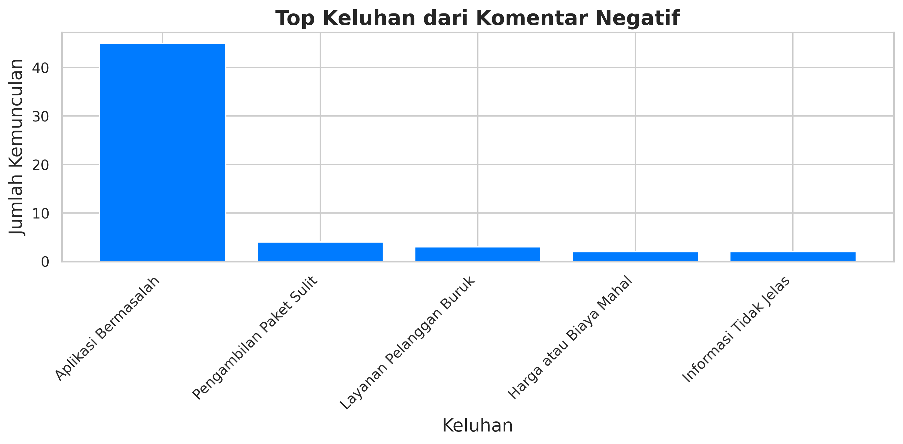
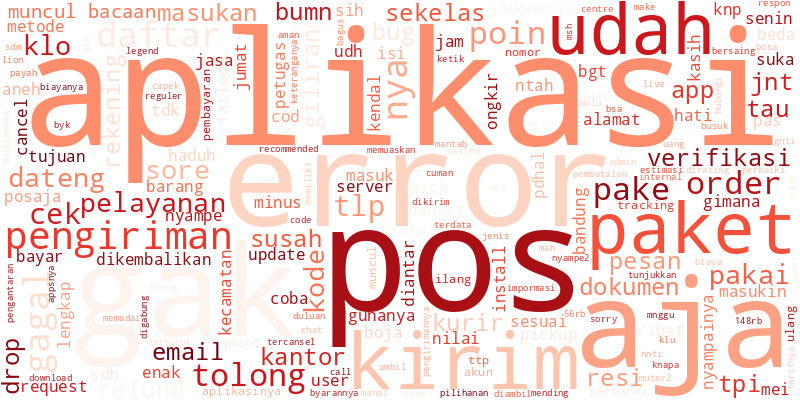

# 📦 Sentiment Analysis of Pos Indonesia App Reviews using NLTK

This project focuses on analyzing user reviews of the **Pos Indonesia** mobile application from the Google Play Store. Using Python and **NLTK's VADER**, the sentiment of each review is classified as **Positive**, **Neutral**, or **Negative**. The goal is to gain insights from user feedback, especially negative reviews, to suggest improvements.

---

## 📂 Project Structure

```
├── data/                 # Raw and cleaned data
├── visuals/              # Plots and word clouds
├── notebooks/            # Jupyter/Colab notebooks
├── models/               # (Optional) Saved models/vectorizers
└── README.md             # Project overview
```

---

## 🧰 Tools & Libraries

* Python
* Google Colab
* NLTK (VADER)
* Pandas, NumPy
* Matplotlib, Seaborn
* WordCloud

---

## 🔍 Problem Statement

> Many users of the Pos Indonesia app leave reviews expressing frustration or satisfaction. However, without automated analysis, it’s hard to extract useful patterns. This project aims to:
>
> * Classify sentiment in reviews using rule-based NLP (NLTK VADER)
> * Visualize trends in user feedback
> * Focus on **negative sentiment** to provide data-driven recommendations

---

## 📊 Data Collection

* **Source**: Google Play Store reviews
* **Method**: Web scraping
* **Dataset size**: \~1000 reviews
* **Columns**:

  * `Review Text`
  * `Rating`
  * `Timestamp`
  * `Sentiment Label` (based on rating and/or VADER score)

---

## ⚙️ Methodology

1. **Text Preprocessing**

   * Lowercasing, punctuation removal
   * Tokenization
   * Stopword removal

2. **Sentiment Scoring**

   * Used **VADER** (Valence Aware Dictionary and sEntiment Reasoner) to compute compound score
   * Rules:

     * Compound ≥ 0.05 → Positive
     * -0.05 < Compound < 0.05 → Neutral
     * Compound ≤ -0.05 → Negative

3. **Visualization**

   * Bar chart: Sentiment distribution
   * Line plot: Sentiment trend over time
   * WordCloud: Most frequent words in each sentiment category

---

## 📊 Results

* **Sentiment Distribution**:

  * Positive: 4.6%
  * Neutral: 87.6%
  * Negative: 8.0%

* **Key Insights from Negative Comments**:

  * Tracking delays
  * Slow delivery
  * Poor customer service

---

## 💡 Recommendations

* Improve customer support responsiveness
* Fix bugs related to tracking and refund visibility
* Enhance app UI to show real-time delivery status

---

## 📌 Sample Visuals




---

## 🚀 Future Work

* Compare with machine learning models (e.g., SVM, LSTM)
* Expand dataset with more reviews
* Create dashboard in Power BI or Streamlit

---

## 📬 Contact

Made with ❤️ by **Nabila**
📧 \[nabilataqiyah06@gmail.com]
📍 Bandung, Indonesia
🌐 \[https://linkedin.com/in/taqiyah-nabila-yasmet]

---

